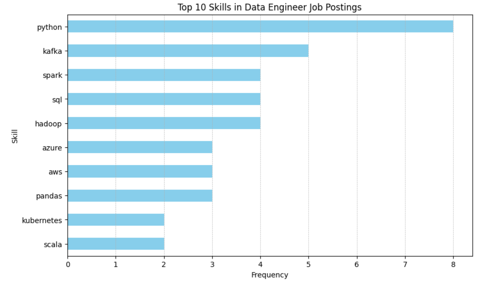

# Introduction
🚀 Dive into the data job market! 📊 Focusing on data engineer roles, this project explores 💰 top-paying jobs, 🔥 in-demand skills, and 📈 where high demand meets high salary in data engineering.

🔍 SQL queries? Check them out here: [SQL_Queries folder](/SQL_Queries/)

# Background
Driven by a quest to navigate the data engineer job market more effectively, this project was born from a desire to pinpoint top-paid and in-demand skills, streamlining other work to find optimal jobs.

Data hails from [SQL Course](https://lukebarousse.com/sql), It's packed with insights on job titles, salaries, locations, and essential skills.

### The questions I wanted to answer through my SQL queries were:

1. What are the top-paying data engineer jobs?
2. What skills are required for these top-paying jobs?
3. What skills are most in demand for data engineering?
4. Which skills are associated with higher salaries?
5. What are the most optimal skills to learnN

# Tools I used
 For my deep dive into the data engineer job market, I harnessed the power of several key tools:

 - **SQL**: The backbone of my analysis, allowing me to query the database and unearth critical insights.
 - **PostgreSQL**: The chosen database management system, ideal for handling the job posting data.
 - **Visual Studio Code**: My go-to for database management and executing SQL queries.
 - **Git & GitHub**: Essential for version control and sharing my SQL scripts and analysis, ensuring collaboration and project tracking.

# The Analysis
Each query for this project aimed at investigating specific aspects of data engineer job market. Here's how I approached each question:

### 1. Top paying Data Engineer Jobs
To identify the highest-paying roles, I filtered data engineer positions by average yearly salary and location, focusing on remote jobs. This query highlights the high paying opportunities in the field.
```SQL
SELECT
    job_title,
    name company,
    job_location,
    job_schedule_type,
    salary_year_avg,
    job_posted_date
FROM
    job_postings_fact job_table
LEFT JOIN company_dim company_table
    ON job_table.company_id = company_table.company_id
WHERE
    job_title = 'Data Engineer'
    AND job_location = 'Anywhere'
    AND salary_year_avg IS NOT NULL
ORDER BY
    salary_year_avg DESC
LIMIT 10;
```
Here are the breakdown of the top data engineer jobs in 2023:
- **Wide Salary Range:** Top 10 paying data engineer roles span from $187,000 to $325,000, indicating significant salary potential in the field.
- **Diverse Employers:** There are multiple companies offering high salaries, showing a broad interest across different industries.

### 2. Skills for Top Paying Jobs
To understand what skills are required for the top-paying jobs, I joined the job postings with the skills data, providing insights into what employers value for high-compensation roles.
```SQL
WITH top_paying_jobs AS (
    SELECT
        job_id,
        job_title,
        name company,
        salary_year_avg
    FROM
        job_postings_fact job_table
    LEFT JOIN company_dim company_table
        ON job_table.company_id = company_table.company_id
    WHERE
        job_title = 'Data Engineer'
        AND job_location = 'Anywhere'
        AND salary_year_avg IS NOT NULL
    ORDER BY
        salary_year_avg DESC
    LIMIT 10
)

SELECT
    job_title,
    company,
    salary_year_avg,
    skill_table.skills skill
FROM
    top_paying_jobs
INNER JOIN skills_job_dim skills_job_table
    ON top_paying_jobs.job_id = skills_job_table.job_id
INNER JOIN skills_dim skill_table
    ON skills_job_table.skill_id = skill_table.skill_id
ORDER BY
        salary_year_avg DESC;
```

*Bar graph visualizing the count of skills for the top 10 paying jobs for data engineers*

### 3. In-Demand Skills for Data Engineers
This query helped identify the skills most frequently requested in job postings, directly focus to areas with high demand.
```SQL
SELECT
    skills,
    COUNT(skill_job_table.job_id) demand_count
FROM
    job_postings_fact job_table
INNER JOIN skills_job_dim skill_job_table
    ON job_table.job_id = skill_job_table.job_id
INNER JOIN skills_dim skill_table
    ON skill_job_table.skill_id = skill_table.skill_id
WHERE
    job_title = 'Data Engineer'
GROUP BY
    skills
ORDER BY
    demand_count DESC
LIMIT 5;
```
Here's the breakdown of the most demanded skills for data engineers in 2023:
- **SQL** tops the list as the most important programming language for datamanipulation and querying databases.
- **Programming languages** like **Python** and **tools** such as **Azure** and **AWS** are essential, highlighting the growing importance of cloud-based data management and analysis.

| Skills | Demand Count |
|--------|--------------|
| SQL    | 37,083       |
| Python | 34,493       |
| AWS    | 19,238       |
| Azure  | 18,875       |
| Spark  | 16,132       |

*Table of the demand for the top 5 skills in data engineer job postings*

### 4. Skills based on Salary
Exploring the average salaries associated with different skills revealed which skills are the highest paying.
```SQL
SELECT
    skills,
    ROUND(AVG(job_table.salary_year_avg),0) salary_avg
FROM
    job_postings_fact job_table
INNER JOIN skills_job_dim skill_job_table
    ON job_table.job_id = skill_job_table.job_id
INNER JOIN skills_dim skill_table
    ON skill_job_table.skill_id = skill_table.skill_id
WHERE
    job_title = 'Data Engineer'
    AND salary_year_avg IS NOT NULL
GROUP BY
    skills
ORDER BY
    salary_avg DESC
LIMIT 25;
```
Here's a breaksown of the results for the paying skills for Data Engineers:
- **Machine Learning** and **AI frameworks** like **Keras** and **Numpy** are valued highly, offering salaries around $140,000 and $137,352 respectively. This emphasizes the demand for skills in building, training, and deploying machine learning models.
- **Cloud Technologies** such as **VMware** and **Kubernetes** offer competitive salaries, averaging $140,000 and $138,313. This is reflective of the industry's shift towards cloud-native architectures and containerized applications for data processing.
- **Database Technologies** like **SQLite** and **Neo4j** are among the top-paying skills, with average salaries of $141,500 and $135,228. This highlights the need for efficient data storage, management, and querying solutions.

| Skills    | Average Salary ($) |
|-----------|--------------------|
| ggplot2   | 176,250            |
| plotly    | 176,250            |
| kotlin    | 159,583            |
| ubuntu    | 150,000            |
| clojure   | 147,500            |
| matlab    | 146,400            |
| colocation| 145,000            |
| next.js   | 145,000            |
| flutter   | 145,000            |
| groovy    | 142,500            |
| sqlite    | 141,500            |
| splunk    | 141,155            |
| keras     | 140,000            |
| vmware    | 140,000            |
| visio     | 139,667            |
| kubernetes| 138,313            |
| golang    | 138,183            |
| centos    | 137,500            |
| aurora    | 137,400            |
| numpy     | 137,352            |
| linux     | 136,642            |
| graphql   | 135,527            |
| neo4j     | 135,228            |
| asana     | 134,875            |
| ruby      | 134,464            |

*Table of the average salary for the top 10 paying skills for data engineers*

### 5. Most Optimal Skills to Learn
Combining insights from demand and salary data, this query aimed to pinpoint skills that are both in high demand and have high salaries, offereing a strategic focus for skill development.
```SQL
SELECT
    skill_table.skill_id,
    skill_table.skills,
    COUNT(skill_job_table.job_id) demand_count,
    ROUND(AVG(job_table.salary_year_avg),0) salary_avg
FROM
    job_postings_fact job_table
INNER JOIN skills_job_dim skill_job_table
    ON job_table.job_id = skill_job_table.job_id
INNER JOIN skills_dim skill_table
    ON skill_job_table.skill_id = skill_table.skill_id
WHERE
    job_title = 'Data Engineer'
    AND salary_year_avg IS NOT NULL
GROUP BY
    skill_table.skill_id
ORDER BY
    demand_count DESC,
    salary_avg DESC
LIMIT 25;
```
Here's a breaksown of the results for the paying skills for Data Engineers:
- **SQL** remains a foundational skill, with the highest demand count of 967 and an average salary of $120,939, indicating its critical role in data management and querying.
- **Python** follows closely with 913 demand count and a higher average salary of $124,767, emphasizing its importance for data manipulation and analysis.
- **AWS** and **Azure**, two leading cloud platforms, have substantial demand counts of 563 and 442, respectively, along with competitive salaries, showcasing the industry's shift toward cloud-based solutions.

| Skills        | Demand Count | Average Salary ($) |
|---------------|--------------|---------------------|
| SQL           | 967          | 120,939             |
| Python        | 913          | 124,767             |
| AWS           | 563          | 124,664             |
| Azure         | 442          | 121,895             |
| Spark         | 388          | 128,998             |
| Snowflake     | 301          | 124,490             |
| Java          | 278          | 123,158             |
| Redshift      | 221          | 124,370             |
| Tableau       | 208          | 117,229             |
| Airflow       | 206          | 129,584             |
| Kafka         | 204          | 128,569             |
| NoSQL         | 198          | 118,934             |
| Hadoop        | 190          | 122,423             |
| Databricks    | 190          | 121,214             |

*Table of the most optimal skills for data engineer sorted by salary*
